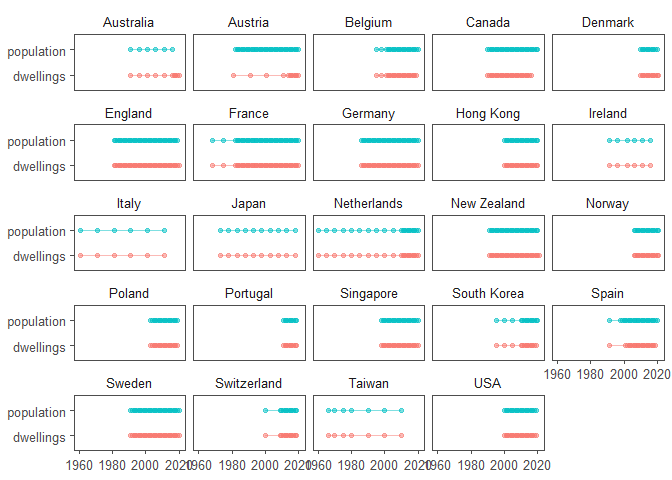
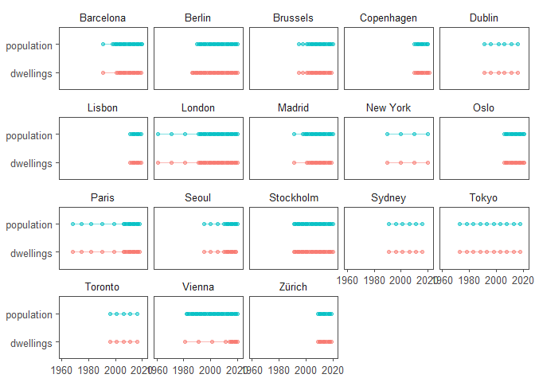
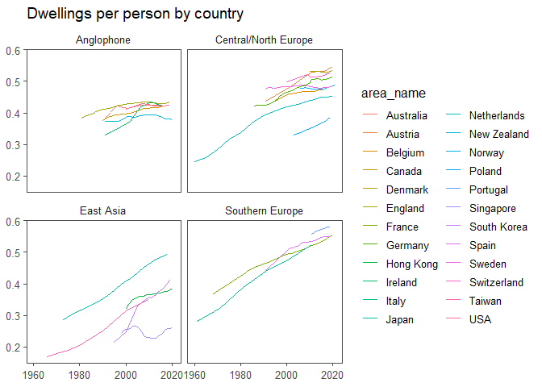

## Introduction

The [Openhouse dataset](https://github.com/jgleeson/openhouse) is a compilation of publicly available data on the number of dwellings and people in cities and countries around the world. The [README](https://github.com/jgleeson/openhouse/blob/main/README.md) provides details about the creation of the dataset, while this note sets out some basic analysis.

Let's start by loading the R packages we're going to use. We're not going to be doing anything very complicated so we can mainly use the [tidyverse](https://www.tidyverse.org/) plus [ggthemes](https://yutannihilation.github.io/allYourFigureAreBelongToUs/ggthemes/) for styling.


```r
library(tidyverse)
library(ggthemes)
library(lubridate)
library(plotly)
```

Another bit of setup is to set the chart theme to use.


```r
theme_set(theme_few())
```

## Loading and examining the data

Now let's load the data. 


```r
d <- read_csv("https://raw.githubusercontent.com/jgleeson/openhouse/main/dataset.csv") %>%
  mutate(ref_date = dmy(ref_date))
```

As a first step, let's see what places and dates we have data for. Openhouse includes data on both cities and countries, so let's start with countries. Each dot is an observation. 


```r
d %>%
  filter(area_level != "city-region") %>%
  ggplot(aes(x = year, y = variable, colour = variable)) +
  geom_point(alpha = 0.5) +
  geom_line(alpha = 0.5) +
  labs(x = NULL, y = NULL) +
  facet_wrap(~area_name) +
  theme(legend.position = "none")
```

<!-- -->

And here's the same thing but for cities.


```r
d %>%
  filter(area_level == "city-region") %>%
  ggplot(aes(x = year, y = variable, colour = variable)) +
  geom_point(alpha = 0.5) +
  geom_line(alpha = 0.5) +
  labs(x = NULL, y = NULL) +
  facet_wrap(~area_name) +
  theme(legend.position = "none")
```

<!-- -->

## Dwellings per person


```r
static <- d %>%
  pivot_wider(id_cols = c(area_name, year, area_level, grouping),
              names_from = variable,
              values_from = value) %>%
  mutate(dpp = dwellings/population) %>%
  arrange(area_name, year) %>%
  filter(!is.na(dpp)) %>%
  filter(area_level != "city-region") %>% 
  ggplot(aes(x = year, y = dpp, group = area_name, colour = area_name)) +
#  geom_point() +
  geom_line() +
  labs(x = NULL, y = NULL, title = "Dwellings per person by country") +
  facet_wrap(~grouping) +
  theme()
static
```

<!-- -->
That's a bit busy so let's see if we can do a plotly version


```r
# dynamic <- ggplotly(static)
ggplotly(static)
```

```{=html}
<div id="htmlwidget-786a8efde5441b7d8d00" style="width:672px;height:480px;" class="plotly html-widget"></div>
<script type="application/json" data-for="htmlwidget-786a8efde5441b7d8d00">{"x":{"data":[{"x":[1991,1996,2001,2006,2011,2016],"y":[0.383019411543827,0.42181263553909,0.415043689776877,0.424398758436606,0.424998830465268,0.424110593432259],"text":["year: 1991<br />dpp: 0.3830194<br />area_name: Australia<br />area_name: Australia","year: 1996<br />dpp: 0.4218126<br />area_name: Australia<br />area_name: Australia","year: 2001<br />dpp: 0.4150437<br />area_name: Australia<br />area_name: Australia","year: 2006<br />dpp: 0.4243988<br />area_name: Australia<br />area_name: Australia","year: 2011<br />dpp: 0.4249988<br />area_name: Australia<br />area_name: Australia","year: 2016<br />dpp: 0.4241106<br />area_name: Australia<br />area_name: Australia"],"type":"scatter","mode":"lines","line":{"width":1.88976377952756,"color":"rgba(248,118,109,1)","dash":"solid"},"hoveron":"points","name":"Australia","legendgroup":"Australia","showlegend":true,"xaxis":"x","yaxis":"y","hoverinfo":"text","frame":null},{"x":[1991,2001,2011,2014,2015,2016,2017,2018,2019,2020],"y":[0.437565273322346,0.480368223341278,0.529461762925441,0.531308301611015,0.531816199720981,0.531239251763712,0.534406593327878,0.538212004539186,0.543054869218014,0.546732325387484],"text":["year: 1991<br />dpp: 0.4375653<br />area_name: Austria<br />area_name: Austria","year: 2001<br />dpp: 0.4803682<br />area_name: Austria<br />area_name: Austria","year: 2011<br />dpp: 0.5294618<br />area_name: Austria<br />area_name: Austria","year: 2014<br />dpp: 0.5313083<br />area_name: Austria<br />area_name: Austria","year: 2015<br />dpp: 0.5318162<br />area_name: Austria<br />area_name: Austria","year: 2016<br />dpp: 0.5312393<br />area_name: Austria<br />area_name: Austria","year: 2017<br />dpp: 0.5344066<br />area_name: Austria<br />area_name: Austria","year: 2018<br />dpp: 0.5382120<br />area_name: Austria<br />area_name: Austria","year: 2019<br />dpp: 0.5430549<br />area_name: Austria<br />area_name: Austria","year: 2020<br />dpp: 0.5467323<br />area_name: Austria<br />area_name: Austria"],"type":"scatter","mode":"lines","line":{"width":1.88976377952756,"color":"rgba(237,129,62,1)","dash":"solid"},"hoveron":"points","name":"Austria","legendgroup":"Austria","showlegend":true,"xaxis":"x2","yaxis":"y","hoverinfo":"text","frame":null},{"x":[1995,1998,2001,2002,2003,2004,2005,2006,2007,2008,2009,2010,2011,2012,2013,2014,2015,2016,2017,2018,2019],"y":[0.437445695618277,0.449530938366589,0.459051442336829,0.460145542194384,0.46177404758125,0.463583765990238,0.465097437719776,0.46641145759901,0.467520913060509,0.468262676345552,0.468798334988673,0.469128281105785,0.468383564055517,0.469161326240392,0.470952256279847,0.472882151821494,0.474162560161241,0.475397300830411,0.477378465880145,0.479556296682422,0.48243750593759],"text":["year: 1995<br />dpp: 0.4374457<br />area_name: Belgium<br />area_name: Belgium","year: 1998<br />dpp: 0.4495309<br />area_name: Belgium<br />area_name: Belgium","year: 2001<br />dpp: 0.4590514<br />area_name: Belgium<br />area_name: Belgium","year: 2002<br />dpp: 0.4601455<br />area_name: Belgium<br />area_name: Belgium","year: 2003<br />dpp: 0.4617740<br />area_name: Belgium<br />area_name: Belgium","year: 2004<br />dpp: 0.4635838<br />area_name: Belgium<br />area_name: Belgium","year: 2005<br />dpp: 0.4650974<br />area_name: Belgium<br />area_name: Belgium","year: 2006<br />dpp: 0.4664115<br />area_name: Belgium<br />area_name: Belgium","year: 2007<br />dpp: 0.4675209<br />area_name: Belgium<br />area_name: Belgium","year: 2008<br />dpp: 0.4682627<br />area_name: Belgium<br />area_name: Belgium","year: 2009<br />dpp: 0.4687983<br />area_name: Belgium<br />area_name: Belgium","year: 2010<br />dpp: 0.4691283<br />area_name: Belgium<br />area_name: Belgium","year: 2011<br />dpp: 0.4683836<br />area_name: Belgium<br />area_name: Belgium","year: 2012<br />dpp: 0.4691613<br />area_name: Belgium<br />area_name: Belgium","year: 2013<br />dpp: 0.4709523<br />area_name: Belgium<br />area_name: Belgium","year: 2014<br />dpp: 0.4728822<br />area_name: Belgium<br />area_name: Belgium","year: 2015<br />dpp: 0.4741626<br />area_name: Belgium<br />area_name: Belgium","year: 2016<br />dpp: 0.4753973<br />area_name: Belgium<br />area_name: Belgium","year: 2017<br />dpp: 0.4773785<br />area_name: Belgium<br />area_name: Belgium","year: 2018<br />dpp: 0.4795563<br />area_name: Belgium<br />area_name: Belgium","year: 2019<br />dpp: 0.4824375<br />area_name: Belgium<br />area_name: Belgium"],"type":"scatter","mode":"lines","line":{"width":1.88976377952756,"color":"rgba(222,140,0,1)","dash":"solid"},"hoveron":"points","name":"Belgium","legendgroup":"Belgium","showlegend":true,"xaxis":"x2","yaxis":"y","hoverinfo":"text","frame":null},{"x":[1990,1991,1992,1993,1994,1995,1996,1997,1998,1999,2000,2001,2002,2003,2004,2005,2006,2007,2008,2009,2010,2011,2012,2013,2014,2015,2016],"y":[0.376494711051601,0.382092396518653,0.385173815308334,0.388201799394271,0.389973601638004,0.392680461278293,0.394193349066191,0.394536698853352,0.395594613236011,0.396647135256055,0.397711900613086,0.397962348096777,0.399288694393914,0.401759788608454,0.40472169402913,0.407588161340896,0.409907023922441,0.412192699540348,0.413956542037719,0.414403952315412,0.41499947257584,0.415809447406775,0.416183545752516,0.416771746187621,0.417378289371113,0.419320409418751,0.419786412363045],"text":["year: 1990<br />dpp: 0.3764947<br />area_name: Canada<br />area_name: Canada","year: 1991<br />dpp: 0.3820924<br />area_name: Canada<br />area_name: Canada","year: 1992<br />dpp: 0.3851738<br />area_name: Canada<br />area_name: Canada","year: 1993<br />dpp: 0.3882018<br />area_name: Canada<br />area_name: Canada","year: 1994<br />dpp: 0.3899736<br />area_name: Canada<br />area_name: Canada","year: 1995<br />dpp: 0.3926805<br />area_name: Canada<br />area_name: Canada","year: 1996<br />dpp: 0.3941933<br />area_name: Canada<br />area_name: Canada","year: 1997<br />dpp: 0.3945367<br />area_name: Canada<br />area_name: Canada","year: 1998<br />dpp: 0.3955946<br />area_name: Canada<br />area_name: Canada","year: 1999<br />dpp: 0.3966471<br />area_name: Canada<br />area_name: Canada","year: 2000<br />dpp: 0.3977119<br />area_name: Canada<br />area_name: Canada","year: 2001<br />dpp: 0.3979623<br />area_name: Canada<br />area_name: Canada","year: 2002<br />dpp: 0.3992887<br />area_name: Canada<br />area_name: Canada","year: 2003<br />dpp: 0.4017598<br />area_name: Canada<br />area_name: Canada","year: 2004<br />dpp: 0.4047217<br />area_name: Canada<br />area_name: Canada","year: 2005<br />dpp: 0.4075882<br />area_name: Canada<br />area_name: Canada","year: 2006<br />dpp: 0.4099070<br />area_name: Canada<br />area_name: Canada","year: 2007<br />dpp: 0.4121927<br />area_name: Canada<br />area_name: Canada","year: 2008<br />dpp: 0.4139565<br />area_name: Canada<br />area_name: Canada","year: 2009<br />dpp: 0.4144040<br />area_name: Canada<br />area_name: Canada","year: 2010<br />dpp: 0.4149995<br />area_name: Canada<br />area_name: Canada","year: 2011<br />dpp: 0.4158094<br />area_name: Canada<br />area_name: Canada","year: 2012<br />dpp: 0.4161835<br />area_name: Canada<br />area_name: Canada","year: 2013<br />dpp: 0.4167717<br />area_name: Canada<br />area_name: Canada","year: 2014<br />dpp: 0.4173783<br />area_name: Canada<br />area_name: Canada","year: 2015<br />dpp: 0.4193204<br />area_name: Canada<br />area_name: Canada","year: 2016<br />dpp: 0.4197864<br />area_name: Canada<br />area_name: Canada"],"type":"scatter","mode":"lines","line":{"width":1.88976377952756,"color":"rgba(205,150,0,1)","dash":"solid"},"hoveron":"points","name":"Canada","legendgroup":"Canada","showlegend":true,"xaxis":"x","yaxis":"y","hoverinfo":"text","frame":null},{"x":[2010,2011,2012,2013,2014,2015,2016,2017,2018,2019,2020],"y":[0.530703350366359,0.530629813754849,0.530869726025335,0.531316732076447,0.531386729006341,0.530322463233573,0.528027591567289,0.527229046775057,0.528736125261408,0.530928004621362,0.534685165788132],"text":["year: 2010<br />dpp: 0.5307034<br />area_name: Denmark<br />area_name: Denmark","year: 2011<br />dpp: 0.5306298<br />area_name: Denmark<br />area_name: Denmark","year: 2012<br />dpp: 0.5308697<br />area_name: Denmark<br />area_name: Denmark","year: 2013<br />dpp: 0.5313167<br />area_name: Denmark<br />area_name: Denmark","year: 2014<br />dpp: 0.5313867<br />area_name: Denmark<br />area_name: Denmark","year: 2015<br />dpp: 0.5303225<br />area_name: Denmark<br />area_name: Denmark","year: 2016<br />dpp: 0.5280276<br />area_name: Denmark<br />area_name: Denmark","year: 2017<br />dpp: 0.5272290<br />area_name: Denmark<br />area_name: Denmark","year: 2018<br />dpp: 0.5287361<br />area_name: Denmark<br />area_name: Denmark","year: 2019<br />dpp: 0.5309280<br />area_name: Denmark<br />area_name: Denmark","year: 2020<br />dpp: 0.5346852<br />area_name: Denmark<br />area_name: Denmark"],"type":"scatter","mode":"lines","line":{"width":1.88976377952756,"color":"rgba(183,159,0,1)","dash":"solid"},"hoveron":"points","name":"Denmark","legendgroup":"Denmark","showlegend":true,"xaxis":"x2","yaxis":"y","hoverinfo":"text","frame":null},{"x":[1981,1982,1983,1984,1985,1986,1987,1988,1989,1990,1991,1992,1993,1994,1995,1996,1997,1998,1999,2000,2001,2002,2003,2004,2005,2006,2007,2008,2009,2010,2011,2012,2013,2014,2015,2016,2017,2018,2019],"y":[0.384828964904487,0.388094225190424,0.391295710443738,0.394096230420955,0.396345739458619,0.398918359908111,0.403336969666218,0.406729899203371,0.409419444111481,0.411642986974597,0.410882506527415,0.413267219467478,0.415510277055359,0.417572073118137,0.41966786197774,0.421854486171425,0.423755979681412,0.425599029917699,0.426795070248751,0.428063932338478,0.42886003352902,0.429827231865183,0.430909875714815,0.432005833296809,0.432160475042485,0.433090932636387,0.433768486856062,0.434442632473816,0.43477714938195,0.433844745215368,0.432635612496987,0.432031472865029,0.43136246003958,0.430297349244982,0.429723890826721,0.429409134744998,0.430604645141803,0.431823188726839,0.433743670829854],"text":["year: 1981<br />dpp: 0.3848290<br />area_name: England<br />area_name: England","year: 1982<br />dpp: 0.3880942<br />area_name: England<br />area_name: England","year: 1983<br />dpp: 0.3912957<br />area_name: England<br />area_name: England","year: 1984<br />dpp: 0.3940962<br />area_name: England<br />area_name: England","year: 1985<br />dpp: 0.3963457<br />area_name: England<br />area_name: England","year: 1986<br />dpp: 0.3989184<br />area_name: England<br />area_name: England","year: 1987<br />dpp: 0.4033370<br />area_name: England<br />area_name: England","year: 1988<br />dpp: 0.4067299<br />area_name: England<br />area_name: England","year: 1989<br />dpp: 0.4094194<br />area_name: England<br />area_name: England","year: 1990<br />dpp: 0.4116430<br />area_name: England<br />area_name: England","year: 1991<br />dpp: 0.4108825<br />area_name: England<br />area_name: England","year: 1992<br />dpp: 0.4132672<br />area_name: England<br />area_name: England","year: 1993<br />dpp: 0.4155103<br />area_name: England<br />area_name: England","year: 1994<br />dpp: 0.4175721<br />area_name: England<br />area_name: England","year: 1995<br />dpp: 0.4196679<br />area_name: England<br />area_name: England","year: 1996<br />dpp: 0.4218545<br />area_name: England<br />area_name: England","year: 1997<br />dpp: 0.4237560<br />area_name: England<br />area_name: England","year: 1998<br />dpp: 0.4255990<br />area_name: England<br />area_name: England","year: 1999<br />dpp: 0.4267951<br />area_name: England<br />area_name: England","year: 2000<br />dpp: 0.4280639<br />area_name: England<br />area_name: England","year: 2001<br />dpp: 0.4288600<br />area_name: England<br />area_name: England","year: 2002<br />dpp: 0.4298272<br />area_name: England<br />area_name: England","year: 2003<br />dpp: 0.4309099<br />area_name: England<br />area_name: England","year: 2004<br />dpp: 0.4320058<br />area_name: England<br />area_name: England","year: 2005<br />dpp: 0.4321605<br />area_name: England<br />area_name: England","year: 2006<br />dpp: 0.4330909<br />area_name: England<br />area_name: England","year: 2007<br />dpp: 0.4337685<br />area_name: England<br />area_name: England","year: 2008<br />dpp: 0.4344426<br />area_name: England<br />area_name: England","year: 2009<br />dpp: 0.4347771<br />area_name: England<br />area_name: England","year: 2010<br />dpp: 0.4338447<br />area_name: England<br />area_name: England","year: 2011<br />dpp: 0.4326356<br />area_name: England<br />area_name: England","year: 2012<br />dpp: 0.4320315<br />area_name: England<br />area_name: England","year: 2013<br />dpp: 0.4313625<br />area_name: England<br />area_name: England","year: 2014<br />dpp: 0.4302973<br />area_name: England<br />area_name: England","year: 2015<br />dpp: 0.4297239<br />area_name: England<br />area_name: England","year: 2016<br />dpp: 0.4294091<br />area_name: England<br />area_name: England","year: 2017<br />dpp: 0.4306046<br />area_name: England<br />area_name: England","year: 2018<br />dpp: 0.4318232<br />area_name: England<br />area_name: England","year: 2019<br />dpp: 0.4337437<br />area_name: England<br />area_name: England"],"type":"scatter","mode":"lines","line":{"width":1.88976377952756,"color":"rgba(157,167,0,1)","dash":"solid"},"hoveron":"points","name":"England","legendgroup":"England","showlegend":true,"xaxis":"x","yaxis":"y","hoverinfo":"text","frame":null},{"x":[1968,1975,1982,1983,1984,1985,1986,1987,1988,1989,1990,1991,1992,1993,1994,1995,1996,1997,1998,1999,2000,2001,2002,2003,2004,2005,2006,2007,2008,2009,2010,2011,2012,2013,2014,2015,2016,2017,2018,2019,2020],"y":[0.367343880744095,0.400792700976643,0.435299530689243,0.439213303337838,0.443903175332245,0.448045837194034,0.451857798232193,0.455463169460459,0.45849149294586,0.460815488802966,0.463032681124839,0.466197956424187,0.468792683129047,0.471403094076973,0.474420154688418,0.477779893125038,0.481031133013609,0.484117821011068,0.487144179342335,0.489891611331412,0.492505733865655,0.494865807322212,0.496934795268812,0.499052932505013,0.501426144939972,0.503368717265532,0.505865391955369,0.5089227101933,0.51209573703756,0.515066594377405,0.518121217900323,0.521005561663022,0.524047197635836,0.527097729256703,0.530127791987369,0.533539066320786,0.537407308640125,0.5411737190225,0.545786494434184,0.550538788139586,0.555549100977821],"text":["year: 1968<br />dpp: 0.3673439<br />area_name: France<br />area_name: France","year: 1975<br />dpp: 0.4007927<br />area_name: France<br />area_name: France","year: 1982<br />dpp: 0.4352995<br />area_name: France<br />area_name: France","year: 1983<br />dpp: 0.4392133<br />area_name: France<br />area_name: France","year: 1984<br />dpp: 0.4439032<br />area_name: France<br />area_name: France","year: 1985<br />dpp: 0.4480458<br />area_name: France<br />area_name: France","year: 1986<br />dpp: 0.4518578<br />area_name: France<br />area_name: France","year: 1987<br />dpp: 0.4554632<br />area_name: France<br />area_name: France","year: 1988<br />dpp: 0.4584915<br />area_name: France<br />area_name: France","year: 1989<br />dpp: 0.4608155<br />area_name: France<br />area_name: France","year: 1990<br />dpp: 0.4630327<br />area_name: France<br />area_name: France","year: 1991<br />dpp: 0.4661980<br />area_name: France<br />area_name: France","year: 1992<br />dpp: 0.4687927<br />area_name: France<br />area_name: France","year: 1993<br />dpp: 0.4714031<br />area_name: France<br />area_name: France","year: 1994<br />dpp: 0.4744202<br />area_name: France<br />area_name: France","year: 1995<br />dpp: 0.4777799<br />area_name: France<br />area_name: France","year: 1996<br />dpp: 0.4810311<br />area_name: France<br />area_name: France","year: 1997<br />dpp: 0.4841178<br />area_name: France<br />area_name: France","year: 1998<br />dpp: 0.4871442<br />area_name: France<br />area_name: France","year: 1999<br />dpp: 0.4898916<br />area_name: France<br />area_name: France","year: 2000<br />dpp: 0.4925057<br />area_name: France<br />area_name: France","year: 2001<br />dpp: 0.4948658<br />area_name: France<br />area_name: France","year: 2002<br />dpp: 0.4969348<br />area_name: France<br />area_name: France","year: 2003<br />dpp: 0.4990529<br />area_name: France<br />area_name: France","year: 2004<br />dpp: 0.5014261<br />area_name: France<br />area_name: France","year: 2005<br />dpp: 0.5033687<br />area_name: France<br />area_name: France","year: 2006<br />dpp: 0.5058654<br />area_name: France<br />area_name: France","year: 2007<br />dpp: 0.5089227<br />area_name: France<br />area_name: France","year: 2008<br />dpp: 0.5120957<br />area_name: France<br />area_name: France","year: 2009<br />dpp: 0.5150666<br />area_name: France<br />area_name: France","year: 2010<br />dpp: 0.5181212<br />area_name: France<br />area_name: France","year: 2011<br />dpp: 0.5210056<br />area_name: France<br />area_name: France","year: 2012<br />dpp: 0.5240472<br />area_name: France<br />area_name: France","year: 2013<br />dpp: 0.5270977<br />area_name: France<br />area_name: France","year: 2014<br />dpp: 0.5301278<br />area_name: France<br />area_name: France","year: 2015<br />dpp: 0.5335391<br />area_name: France<br />area_name: France","year: 2016<br />dpp: 0.5374073<br />area_name: France<br />area_name: France","year: 2017<br />dpp: 0.5411737<br />area_name: France<br />area_name: France","year: 2018<br />dpp: 0.5457865<br />area_name: France<br />area_name: France","year: 2019<br />dpp: 0.5505388<br />area_name: France<br />area_name: France","year: 2020<br />dpp: 0.5555491<br />area_name: France<br />area_name: France"],"type":"scatter","mode":"lines","line":{"width":1.88976377952756,"color":"rgba(124,174,0,1)","dash":"solid"},"hoveron":"points","name":"France","legendgroup":"France","showlegend":true,"xaxis":"x2","yaxis":"y2","hoverinfo":"text","frame":null},{"x":[1986,1987,1988,1989,1990,1991,1992,1993,1994,1995,1996,1997,1998,1999,2000,2001,2002,2003,2004,2005,2006,2007,2008,2009,2010,2011,2012,2013,2014,2015,2016,2017,2018,2019,2020],"y":[0.423073990755864,0.425513901231358,0.425783898874004,0.424720081120596,0.424513493353692,0.425708708925532,0.426644087743431,0.43016441263259,0.433791954959052,0.439445319637551,0.444962333757279,0.451517821450281,0.457466008848128,0.462301503192264,0.466616334105442,0.469209801239343,0.471606514824682,0.474260881013787,0.477113465826273,0.479769104039951,0.482946952524006,0.485517430968173,0.48848940388981,0.491228047656436,0.495149562940675,0.50580560427946,0.506754926677157,0.507569997586776,0.507665768236295,0.50436171605216,0.505362477409414,0.506907528208735,0.508742500365548,0.511175330716156,0.514746209402532],"text":["year: 1986<br />dpp: 0.4230740<br />area_name: Germany<br />area_name: Germany","year: 1987<br />dpp: 0.4255139<br />area_name: Germany<br />area_name: Germany","year: 1988<br />dpp: 0.4257839<br />area_name: Germany<br />area_name: Germany","year: 1989<br />dpp: 0.4247201<br />area_name: Germany<br />area_name: Germany","year: 1990<br />dpp: 0.4245135<br />area_name: Germany<br />area_name: Germany","year: 1991<br />dpp: 0.4257087<br />area_name: Germany<br />area_name: Germany","year: 1992<br />dpp: 0.4266441<br />area_name: Germany<br />area_name: Germany","year: 1993<br />dpp: 0.4301644<br />area_name: Germany<br />area_name: Germany","year: 1994<br />dpp: 0.4337920<br />area_name: Germany<br />area_name: Germany","year: 1995<br />dpp: 0.4394453<br />area_name: Germany<br />area_name: Germany","year: 1996<br />dpp: 0.4449623<br />area_name: Germany<br />area_name: Germany","year: 1997<br />dpp: 0.4515178<br />area_name: Germany<br />area_name: Germany","year: 1998<br />dpp: 0.4574660<br />area_name: Germany<br />area_name: Germany","year: 1999<br />dpp: 0.4623015<br />area_name: Germany<br />area_name: Germany","year: 2000<br />dpp: 0.4666163<br />area_name: Germany<br />area_name: Germany","year: 2001<br />dpp: 0.4692098<br />area_name: Germany<br />area_name: Germany","year: 2002<br />dpp: 0.4716065<br />area_name: Germany<br />area_name: Germany","year: 2003<br />dpp: 0.4742609<br />area_name: Germany<br />area_name: Germany","year: 2004<br />dpp: 0.4771135<br />area_name: Germany<br />area_name: Germany","year: 2005<br />dpp: 0.4797691<br />area_name: Germany<br />area_name: Germany","year: 2006<br />dpp: 0.4829470<br />area_name: Germany<br />area_name: Germany","year: 2007<br />dpp: 0.4855174<br />area_name: Germany<br />area_name: Germany","year: 2008<br />dpp: 0.4884894<br />area_name: Germany<br />area_name: Germany","year: 2009<br />dpp: 0.4912280<br />area_name: Germany<br />area_name: Germany","year: 2010<br />dpp: 0.4951496<br />area_name: Germany<br />area_name: Germany","year: 2011<br />dpp: 0.5058056<br />area_name: Germany<br />area_name: Germany","year: 2012<br />dpp: 0.5067549<br />area_name: Germany<br />area_name: Germany","year: 2013<br />dpp: 0.5075700<br />area_name: Germany<br />area_name: Germany","year: 2014<br />dpp: 0.5076658<br />area_name: Germany<br />area_name: Germany","year: 2015<br />dpp: 0.5043617<br />area_name: Germany<br />area_name: Germany","year: 2016<br />dpp: 0.5053625<br />area_name: Germany<br />area_name: Germany","year: 2017<br />dpp: 0.5069075<br />area_name: Germany<br />area_name: Germany","year: 2018<br />dpp: 0.5087425<br />area_name: Germany<br />area_name: Germany","year: 2019<br />dpp: 0.5111753<br />area_name: Germany<br />area_name: Germany","year: 2020<br />dpp: 0.5147462<br />area_name: Germany<br />area_name: Germany"],"type":"scatter","mode":"lines","line":{"width":1.88976377952756,"color":"rgba(73,181,0,1)","dash":"solid"},"hoveron":"points","name":"Germany","legendgroup":"Germany","showlegend":true,"xaxis":"x2","yaxis":"y","hoverinfo":"text","frame":null},{"x":[2000,2001,2002,2003,2004,2005,2006,2007,2008,2009,2010,2011,2012,2013,2014,2015,2016,2017,2018,2019,2020],"y":[0.320360090022506,0.333109929553341,0.3402974451743,0.350701253937125,0.352708778654087,0.356836728703106,0.361260591212028,0.361638448303284,0.361795395096151,0.365190454336852,0.364596680048974,0.366706261666384,0.367771080124754,0.368816949671955,0.369582958710838,0.369700876386927,0.372584030749939,0.375231678774842,0.376379009528922,0.379958441004875,0.387286481862653],"text":["year: 2000<br />dpp: 0.3203601<br />area_name: Hong Kong<br />area_name: Hong Kong","year: 2001<br />dpp: 0.3331099<br />area_name: Hong Kong<br />area_name: Hong Kong","year: 2002<br />dpp: 0.3402974<br />area_name: Hong Kong<br />area_name: Hong Kong","year: 2003<br />dpp: 0.3507013<br />area_name: Hong Kong<br />area_name: Hong Kong","year: 2004<br />dpp: 0.3527088<br />area_name: Hong Kong<br />area_name: Hong Kong","year: 2005<br />dpp: 0.3568367<br />area_name: Hong Kong<br />area_name: Hong Kong","year: 2006<br />dpp: 0.3612606<br />area_name: Hong Kong<br />area_name: Hong Kong","year: 2007<br />dpp: 0.3616384<br />area_name: Hong Kong<br />area_name: Hong Kong","year: 2008<br />dpp: 0.3617954<br />area_name: Hong Kong<br />area_name: Hong Kong","year: 2009<br />dpp: 0.3651905<br />area_name: Hong Kong<br />area_name: Hong Kong","year: 2010<br />dpp: 0.3645967<br />area_name: Hong Kong<br />area_name: Hong Kong","year: 2011<br />dpp: 0.3667063<br />area_name: Hong Kong<br />area_name: Hong Kong","year: 2012<br />dpp: 0.3677711<br />area_name: Hong Kong<br />area_name: Hong Kong","year: 2013<br />dpp: 0.3688169<br />area_name: Hong Kong<br />area_name: Hong Kong","year: 2014<br />dpp: 0.3695830<br />area_name: Hong Kong<br />area_name: Hong Kong","year: 2015<br />dpp: 0.3697009<br />area_name: Hong Kong<br />area_name: Hong Kong","year: 2016<br />dpp: 0.3725840<br />area_name: Hong Kong<br />area_name: Hong Kong","year: 2017<br />dpp: 0.3752317<br />area_name: Hong Kong<br />area_name: Hong Kong","year: 2018<br />dpp: 0.3763790<br />area_name: Hong Kong<br />area_name: Hong Kong","year: 2019<br />dpp: 0.3799584<br />area_name: Hong Kong<br />area_name: Hong Kong","year: 2020<br />dpp: 0.3872865<br />area_name: Hong Kong<br />area_name: Hong Kong"],"type":"scatter","mode":"lines","line":{"width":1.88976377952756,"color":"rgba(0,186,56,1)","dash":"solid"},"hoveron":"points","name":"Hong Kong","legendgroup":"Hong Kong","showlegend":true,"xaxis":"x","yaxis":"y2","hoverinfo":"text","frame":null},{"x":[1991,1996,2002,2006,2011,2016],"y":[0.329081529185962,0.34719189032144,0.372728449355318,0.417376519158234,0.434772327239219,0.420768963420845],"text":["year: 1991<br />dpp: 0.3290815<br />area_name: Ireland<br />area_name: Ireland","year: 1996<br />dpp: 0.3471919<br />area_name: Ireland<br />area_name: Ireland","year: 2002<br />dpp: 0.3727284<br />area_name: Ireland<br />area_name: Ireland","year: 2006<br />dpp: 0.4173765<br />area_name: Ireland<br />area_name: Ireland","year: 2011<br />dpp: 0.4347723<br />area_name: Ireland<br />area_name: Ireland","year: 2016<br />dpp: 0.4207690<br />area_name: Ireland<br />area_name: Ireland"],"type":"scatter","mode":"lines","line":{"width":1.88976377952756,"color":"rgba(0,190,103,1)","dash":"solid"},"hoveron":"points","name":"Ireland","legendgroup":"Ireland","showlegend":true,"xaxis":"x","yaxis":"y","hoverinfo":"text","frame":null},{"x":[1961,1971,1981,1991,2001,2011],"y":[0.280771729073468,0.322037015031638,0.387878733334641,0.440813489992282,0.47884264832125,0.525091621352342],"text":["year: 1961<br />dpp: 0.2807717<br />area_name: Italy<br />area_name: Italy","year: 1971<br />dpp: 0.3220370<br />area_name: Italy<br />area_name: Italy","year: 1981<br />dpp: 0.3878787<br />area_name: Italy<br />area_name: Italy","year: 1991<br />dpp: 0.4408135<br />area_name: Italy<br />area_name: Italy","year: 2001<br />dpp: 0.4788426<br />area_name: Italy<br />area_name: Italy","year: 2011<br />dpp: 0.5250916<br />area_name: Italy<br />area_name: Italy"],"type":"scatter","mode":"lines","line":{"width":1.88976377952756,"color":"rgba(0,192,139,1)","dash":"solid"},"hoveron":"points","name":"Italy","legendgroup":"Italy","showlegend":true,"xaxis":"x2","yaxis":"y2","hoverinfo":"text","frame":null},{"x":[1973,1978,1983,1988,1993,1998,2003,2008,2013,2018],"y":[0.286904197762142,0.308269506358349,0.323595332330867,0.342472219731125,0.368189164939899,0.397732309991514,0.422814331981773,0.451587252419441,0.476905759578255,0.494091008055737],"text":["year: 1973<br />dpp: 0.2869042<br />area_name: Japan<br />area_name: Japan","year: 1978<br />dpp: 0.3082695<br />area_name: Japan<br />area_name: Japan","year: 1983<br />dpp: 0.3235953<br />area_name: Japan<br />area_name: Japan","year: 1988<br />dpp: 0.3424722<br />area_name: Japan<br />area_name: Japan","year: 1993<br />dpp: 0.3681892<br />area_name: Japan<br />area_name: Japan","year: 1998<br />dpp: 0.3977323<br />area_name: Japan<br />area_name: Japan","year: 2003<br />dpp: 0.4228143<br />area_name: Japan<br />area_name: Japan","year: 2008<br />dpp: 0.4515873<br />area_name: Japan<br />area_name: Japan","year: 2013<br />dpp: 0.4769058<br />area_name: Japan<br />area_name: Japan","year: 2018<br />dpp: 0.4940910<br />area_name: Japan<br />area_name: Japan"],"type":"scatter","mode":"lines","line":{"width":1.88976377952756,"color":"rgba(0,193,169,1)","dash":"solid"},"hoveron":"points","name":"Japan","legendgroup":"Japan","showlegend":true,"xaxis":"x","yaxis":"y2","hoverinfo":"text","frame":null},{"x":[1960,1965,1970,1975,1980,1985,1990,1995,2000,2005,2010,2011,2012,2013,2014,2015,2016,2017,2018,2019,2020],"y":[0.246819419100249,0.258756173811763,0.284542972818853,0.317521199209477,0.33801683824883,0.367999270504924,0.392611780878175,0.405403951032026,0.420387104094504,0.426603839704405,0.439819296410996,0.440627315447311,0.441532955560757,0.44393257874529,0.447731333153765,0.448974795520618,0.450023322763488,0.449960299170325,0.450553643763106,0.452200340894829,0.453365587472358],"text":["year: 1960<br />dpp: 0.2468194<br />area_name: Netherlands<br />area_name: Netherlands","year: 1965<br />dpp: 0.2587562<br />area_name: Netherlands<br />area_name: Netherlands","year: 1970<br />dpp: 0.2845430<br />area_name: Netherlands<br />area_name: Netherlands","year: 1975<br />dpp: 0.3175212<br />area_name: Netherlands<br />area_name: Netherlands","year: 1980<br />dpp: 0.3380168<br />area_name: Netherlands<br />area_name: Netherlands","year: 1985<br />dpp: 0.3679993<br />area_name: Netherlands<br />area_name: Netherlands","year: 1990<br />dpp: 0.3926118<br />area_name: Netherlands<br />area_name: Netherlands","year: 1995<br />dpp: 0.4054040<br />area_name: Netherlands<br />area_name: Netherlands","year: 2000<br />dpp: 0.4203871<br />area_name: Netherlands<br />area_name: Netherlands","year: 2005<br />dpp: 0.4266038<br />area_name: Netherlands<br />area_name: Netherlands","year: 2010<br />dpp: 0.4398193<br />area_name: Netherlands<br />area_name: Netherlands","year: 2011<br />dpp: 0.4406273<br />area_name: Netherlands<br />area_name: Netherlands","year: 2012<br />dpp: 0.4415330<br />area_name: Netherlands<br />area_name: Netherlands","year: 2013<br />dpp: 0.4439326<br />area_name: Netherlands<br />area_name: Netherlands","year: 2014<br />dpp: 0.4477313<br />area_name: Netherlands<br />area_name: Netherlands","year: 2015<br />dpp: 0.4489748<br />area_name: Netherlands<br />area_name: Netherlands","year: 2016<br />dpp: 0.4500233<br />area_name: Netherlands<br />area_name: Netherlands","year: 2017<br />dpp: 0.4499603<br />area_name: Netherlands<br />area_name: Netherlands","year: 2018<br />dpp: 0.4505536<br />area_name: Netherlands<br />area_name: Netherlands","year: 2019<br />dpp: 0.4522003<br />area_name: Netherlands<br />area_name: Netherlands","year: 2020<br />dpp: 0.4533656<br />area_name: Netherlands<br />area_name: Netherlands"],"type":"scatter","mode":"lines","line":{"width":1.88976377952756,"color":"rgba(0,191,196,1)","dash":"solid"},"hoveron":"points","name":"Netherlands","legendgroup":"Netherlands","showlegend":true,"xaxis":"x2","yaxis":"y","hoverinfo":"text","frame":null},{"x":[1991,1992,1993,1994,1995,1996,1997,1998,1999,2000,2001,2002,2003,2004,2005,2006,2007,2008,2009,2010,2011,2012,2013,2014,2015,2016,2017,2018,2019,2020],"y":[0.37319380733945,0.373911810577059,0.374396812927842,0.374221237712862,0.374239157136228,0.373636998442284,0.374576181394363,0.377492653232578,0.381137490216541,0.385539044062346,0.389195603942005,0.387936072363239,0.386116163755513,0.3868144261652,0.389521640091116,0.390938914298029,0.392330663127459,0.394350972835793,0.395155467567253,0.393147249004763,0.393086138049059,0.393623056847838,0.394364292155095,0.392348537024283,0.388967529780701,0.385090521831736,0.382158567348385,0.380303309387855,0.380258997442249,0.377467558002359],"text":["year: 1991<br />dpp: 0.3731938<br />area_name: New Zealand<br />area_name: New Zealand","year: 1992<br />dpp: 0.3739118<br />area_name: New Zealand<br />area_name: New Zealand","year: 1993<br />dpp: 0.3743968<br />area_name: New Zealand<br />area_name: New Zealand","year: 1994<br />dpp: 0.3742212<br />area_name: New Zealand<br />area_name: New Zealand","year: 1995<br />dpp: 0.3742392<br />area_name: New Zealand<br />area_name: New Zealand","year: 1996<br />dpp: 0.3736370<br />area_name: New Zealand<br />area_name: New Zealand","year: 1997<br />dpp: 0.3745762<br />area_name: New Zealand<br />area_name: New Zealand","year: 1998<br />dpp: 0.3774927<br />area_name: New Zealand<br />area_name: New Zealand","year: 1999<br />dpp: 0.3811375<br />area_name: New Zealand<br />area_name: New Zealand","year: 2000<br />dpp: 0.3855390<br />area_name: New Zealand<br />area_name: New Zealand","year: 2001<br />dpp: 0.3891956<br />area_name: New Zealand<br />area_name: New Zealand","year: 2002<br />dpp: 0.3879361<br />area_name: New Zealand<br />area_name: New Zealand","year: 2003<br />dpp: 0.3861162<br />area_name: New Zealand<br />area_name: New Zealand","year: 2004<br />dpp: 0.3868144<br />area_name: New Zealand<br />area_name: New Zealand","year: 2005<br />dpp: 0.3895216<br />area_name: New Zealand<br />area_name: New Zealand","year: 2006<br />dpp: 0.3909389<br />area_name: New Zealand<br />area_name: New Zealand","year: 2007<br />dpp: 0.3923307<br />area_name: New Zealand<br />area_name: New Zealand","year: 2008<br />dpp: 0.3943510<br />area_name: New Zealand<br />area_name: New Zealand","year: 2009<br />dpp: 0.3951555<br />area_name: New Zealand<br />area_name: New Zealand","year: 2010<br />dpp: 0.3931472<br />area_name: New Zealand<br />area_name: New Zealand","year: 2011<br />dpp: 0.3930861<br />area_name: New Zealand<br />area_name: New Zealand","year: 2012<br />dpp: 0.3936231<br />area_name: New Zealand<br />area_name: New Zealand","year: 2013<br />dpp: 0.3943643<br />area_name: New Zealand<br />area_name: New Zealand","year: 2014<br />dpp: 0.3923485<br />area_name: New Zealand<br />area_name: New Zealand","year: 2015<br />dpp: 0.3889675<br />area_name: New Zealand<br />area_name: New Zealand","year: 2016<br />dpp: 0.3850905<br />area_name: New Zealand<br />area_name: New Zealand","year: 2017<br />dpp: 0.3821586<br />area_name: New Zealand<br />area_name: New Zealand","year: 2018<br />dpp: 0.3803033<br />area_name: New Zealand<br />area_name: New Zealand","year: 2019<br />dpp: 0.3802590<br />area_name: New Zealand<br />area_name: New Zealand","year: 2020<br />dpp: 0.3774676<br />area_name: New Zealand<br />area_name: New Zealand"],"type":"scatter","mode":"lines","line":{"width":1.88976377952756,"color":"rgba(0,187,220,1)","dash":"solid"},"hoveron":"points","name":"New Zealand","legendgroup":"New Zealand","showlegend":true,"xaxis":"x","yaxis":"y","hoverinfo":"text","frame":null},{"x":[2006,2007,2008,2009,2010,2011,2012,2013,2014,2015,2016,2017,2018,2019,2020,2021],"y":[0.477298593018993,0.479082846165053,0.480109753268354,0.479395330772379,0.478351133825518,0.476192024681397,0.475095018522344,0.474983840713483,0.474993227711734,0.475493253516105,0.476670531273105,0.47840192974292,0.48110183153282,0.484431738076488,0.486260102317991,0.489211738243107],"text":["year: 2006<br />dpp: 0.4772986<br />area_name: Norway<br />area_name: Norway","year: 2007<br />dpp: 0.4790828<br />area_name: Norway<br />area_name: Norway","year: 2008<br />dpp: 0.4801098<br />area_name: Norway<br />area_name: Norway","year: 2009<br />dpp: 0.4793953<br />area_name: Norway<br />area_name: Norway","year: 2010<br />dpp: 0.4783511<br />area_name: Norway<br />area_name: Norway","year: 2011<br />dpp: 0.4761920<br />area_name: Norway<br />area_name: Norway","year: 2012<br />dpp: 0.4750950<br />area_name: Norway<br />area_name: Norway","year: 2013<br />dpp: 0.4749838<br />area_name: Norway<br />area_name: Norway","year: 2014<br />dpp: 0.4749932<br />area_name: Norway<br />area_name: Norway","year: 2015<br />dpp: 0.4754933<br />area_name: Norway<br />area_name: Norway","year: 2016<br />dpp: 0.4766705<br />area_name: Norway<br />area_name: Norway","year: 2017<br />dpp: 0.4784019<br />area_name: Norway<br />area_name: Norway","year: 2018<br />dpp: 0.4811018<br />area_name: Norway<br />area_name: Norway","year: 2019<br />dpp: 0.4844317<br />area_name: Norway<br />area_name: Norway","year: 2020<br />dpp: 0.4862601<br />area_name: Norway<br />area_name: Norway","year: 2021<br />dpp: 0.4892117<br />area_name: Norway<br />area_name: Norway"],"type":"scatter","mode":"lines","line":{"width":1.88976377952756,"color":"rgba(0,180,240,1)","dash":"solid"},"hoveron":"points","name":"Norway","legendgroup":"Norway","showlegend":true,"xaxis":"x2","yaxis":"y","hoverinfo":"text","frame":null},{"x":[2003,2004,2005,2006,2007,2008,2009,2010,2011,2012,2013,2014,2015,2016,2017,2018,2019],"y":[0.329816456443951,0.332253544869149,0.334830347887173,0.337744635287074,0.340902465735785,0.344827374622259,0.348529733374845,0.349610040169878,0.352568436398073,0.356127981671126,0.359856055458097,0.363397791842853,0.367337830898832,0.371347877365364,0.375707526219665,0.380491413586493,0.38592443612956],"text":["year: 2003<br />dpp: 0.3298165<br />area_name: Poland<br />area_name: Poland","year: 2004<br />dpp: 0.3322535<br />area_name: Poland<br />area_name: Poland","year: 2005<br />dpp: 0.3348303<br />area_name: Poland<br />area_name: Poland","year: 2006<br />dpp: 0.3377446<br />area_name: Poland<br />area_name: Poland","year: 2007<br />dpp: 0.3409025<br />area_name: Poland<br />area_name: Poland","year: 2008<br />dpp: 0.3448274<br />area_name: Poland<br />area_name: Poland","year: 2009<br />dpp: 0.3485297<br />area_name: Poland<br />area_name: Poland","year: 2010<br />dpp: 0.3496100<br />area_name: Poland<br />area_name: Poland","year: 2011<br />dpp: 0.3525684<br />area_name: Poland<br />area_name: Poland","year: 2012<br />dpp: 0.3561280<br />area_name: Poland<br />area_name: Poland","year: 2013<br />dpp: 0.3598561<br />area_name: Poland<br />area_name: Poland","year: 2014<br />dpp: 0.3633978<br />area_name: Poland<br />area_name: Poland","year: 2015<br />dpp: 0.3673378<br />area_name: Poland<br />area_name: Poland","year: 2016<br />dpp: 0.3713479<br />area_name: Poland<br />area_name: Poland","year: 2017<br />dpp: 0.3757075<br />area_name: Poland<br />area_name: Poland","year: 2018<br />dpp: 0.3804914<br />area_name: Poland<br />area_name: Poland","year: 2019<br />dpp: 0.3859244<br />area_name: Poland<br />area_name: Poland"],"type":"scatter","mode":"lines","line":{"width":1.88976377952756,"color":"rgba(0,169,255,1)","dash":"solid"},"hoveron":"points","name":"Poland","legendgroup":"Poland","showlegend":true,"xaxis":"x2","yaxis":"y","hoverinfo":"text","frame":null},{"x":[2011,2012,2013,2014,2015,2016,2017,2018,2019],"y":[0.557675587660417,0.562481686163126,0.566939134105748,0.570599765470675,0.573122315988369,0.575628883950868,0.577436732019069,0.579366342055951,0.579682085379737],"text":["year: 2011<br />dpp: 0.5576756<br />area_name: Portugal<br />area_name: Portugal","year: 2012<br />dpp: 0.5624817<br />area_name: Portugal<br />area_name: Portugal","year: 2013<br />dpp: 0.5669391<br />area_name: Portugal<br />area_name: Portugal","year: 2014<br />dpp: 0.5705998<br />area_name: Portugal<br />area_name: Portugal","year: 2015<br />dpp: 0.5731223<br />area_name: Portugal<br />area_name: Portugal","year: 2016<br />dpp: 0.5756289<br />area_name: Portugal<br />area_name: Portugal","year: 2017<br />dpp: 0.5774367<br />area_name: Portugal<br />area_name: Portugal","year: 2018<br />dpp: 0.5793663<br />area_name: Portugal<br />area_name: Portugal","year: 2019<br />dpp: 0.5796821<br />area_name: Portugal<br />area_name: Portugal"],"type":"scatter","mode":"lines","line":{"width":1.88976377952756,"color":"rgba(97,156,255,1)","dash":"solid"},"hoveron":"points","name":"Portugal","legendgroup":"Portugal","showlegend":true,"xaxis":"x2","yaxis":"y2","hoverinfo":"text","frame":null},{"x":[1998,1999,2000,2001,2002,2003,2004,2005,2006,2007,2008,2009,2010,2011,2012,2013,2014,2015,2016,2017,2018,2019,2020],"y":[0.243098604532018,0.253111925234476,0.256700597608622,0.256392683249831,0.258798117793556,0.265710141814016,0.265650410016262,0.262530352138727,0.255780649866576,0.245932364105035,0.235475873435445,0.230062196583388,0.229459817851326,0.229008767502982,0.228937679637424,0.228167630458208,0.23238997068225,0.239005875697967,0.244381993917553,0.253249808944821,0.259097703077815,0.259070592465875,0.262222407478833],"text":["year: 1998<br />dpp: 0.2430986<br />area_name: Singapore<br />area_name: Singapore","year: 1999<br />dpp: 0.2531119<br />area_name: Singapore<br />area_name: Singapore","year: 2000<br />dpp: 0.2567006<br />area_name: Singapore<br />area_name: Singapore","year: 2001<br />dpp: 0.2563927<br />area_name: Singapore<br />area_name: Singapore","year: 2002<br />dpp: 0.2587981<br />area_name: Singapore<br />area_name: Singapore","year: 2003<br />dpp: 0.2657101<br />area_name: Singapore<br />area_name: Singapore","year: 2004<br />dpp: 0.2656504<br />area_name: Singapore<br />area_name: Singapore","year: 2005<br />dpp: 0.2625304<br />area_name: Singapore<br />area_name: Singapore","year: 2006<br />dpp: 0.2557806<br />area_name: Singapore<br />area_name: Singapore","year: 2007<br />dpp: 0.2459324<br />area_name: Singapore<br />area_name: Singapore","year: 2008<br />dpp: 0.2354759<br />area_name: Singapore<br />area_name: Singapore","year: 2009<br />dpp: 0.2300622<br />area_name: Singapore<br />area_name: Singapore","year: 2010<br />dpp: 0.2294598<br />area_name: Singapore<br />area_name: Singapore","year: 2011<br />dpp: 0.2290088<br />area_name: Singapore<br />area_name: Singapore","year: 2012<br />dpp: 0.2289377<br />area_name: Singapore<br />area_name: Singapore","year: 2013<br />dpp: 0.2281676<br />area_name: Singapore<br />area_name: Singapore","year: 2014<br />dpp: 0.2323900<br />area_name: Singapore<br />area_name: Singapore","year: 2015<br />dpp: 0.2390059<br />area_name: Singapore<br />area_name: Singapore","year: 2016<br />dpp: 0.2443820<br />area_name: Singapore<br />area_name: Singapore","year: 2017<br />dpp: 0.2532498<br />area_name: Singapore<br />area_name: Singapore","year: 2018<br />dpp: 0.2590977<br />area_name: Singapore<br />area_name: Singapore","year: 2019<br />dpp: 0.2590706<br />area_name: Singapore<br />area_name: Singapore","year: 2020<br />dpp: 0.2622224<br />area_name: Singapore<br />area_name: Singapore"],"type":"scatter","mode":"lines","line":{"width":1.88976377952756,"color":"rgba(159,140,255,1)","dash":"solid"},"hoveron":"points","name":"Singapore","legendgroup":"Singapore","showlegend":true,"xaxis":"x","yaxis":"y2","hoverinfo":"text","frame":null},{"x":[1995,2000,2005,2010,2011,2012,2013,2014,2015,2016,2017,2018,2019],"y":[0.214539666883364,0.248664817062598,0.330432115738489,0.356838526684235,0.356407907520682,0.361433259208477,0.366475632501949,0.373309526145577,0.379572118702553,0.384498161335445,0.392313078560108,0.401689813998784,0.410996280202178],"text":["year: 1995<br />dpp: 0.2145397<br />area_name: South Korea<br />area_name: South Korea","year: 2000<br />dpp: 0.2486648<br />area_name: South Korea<br />area_name: South Korea","year: 2005<br />dpp: 0.3304321<br />area_name: South Korea<br />area_name: South Korea","year: 2010<br />dpp: 0.3568385<br />area_name: South Korea<br />area_name: South Korea","year: 2011<br />dpp: 0.3564079<br />area_name: South Korea<br />area_name: South Korea","year: 2012<br />dpp: 0.3614333<br />area_name: South Korea<br />area_name: South Korea","year: 2013<br />dpp: 0.3664756<br />area_name: South Korea<br />area_name: South Korea","year: 2014<br />dpp: 0.3733095<br />area_name: South Korea<br />area_name: South Korea","year: 2015<br />dpp: 0.3795721<br />area_name: South Korea<br />area_name: South Korea","year: 2016<br />dpp: 0.3844982<br />area_name: South Korea<br />area_name: South Korea","year: 2017<br />dpp: 0.3923131<br />area_name: South Korea<br />area_name: South Korea","year: 2018<br />dpp: 0.4016898<br />area_name: South Korea<br />area_name: South Korea","year: 2019<br />dpp: 0.4109963<br />area_name: South Korea<br />area_name: South Korea"],"type":"scatter","mode":"lines","line":{"width":1.88976377952756,"color":"rgba(199,124,255,1)","dash":"solid"},"hoveron":"points","name":"South Korea","legendgroup":"South Korea","showlegend":true,"xaxis":"x","yaxis":"y2","hoverinfo":"text","frame":null},{"x":[1991,2001,2002,2003,2004,2005,2006,2007,2008,2009,2010,2011,2012,2013,2014,2015,2016,2017,2018,2019],"y":[0.442999595495689,0.511560664119098,0.513584813805399,0.51329391458177,0.518961849899175,0.519794742649551,0.525482361881613,0.531738365239487,0.532297971078445,0.532841929544611,0.533936633588489,0.53504533211806,0.537019837440647,0.539813773384019,0.545041781034245,0.547823132540395,0.549568799610147,0.550653339211527,0.550319307544168,0.548488259993236],"text":["year: 1991<br />dpp: 0.4429996<br />area_name: Spain<br />area_name: Spain","year: 2001<br />dpp: 0.5115607<br />area_name: Spain<br />area_name: Spain","year: 2002<br />dpp: 0.5135848<br />area_name: Spain<br />area_name: Spain","year: 2003<br />dpp: 0.5132939<br />area_name: Spain<br />area_name: Spain","year: 2004<br />dpp: 0.5189618<br />area_name: Spain<br />area_name: Spain","year: 2005<br />dpp: 0.5197947<br />area_name: Spain<br />area_name: Spain","year: 2006<br />dpp: 0.5254824<br />area_name: Spain<br />area_name: Spain","year: 2007<br />dpp: 0.5317384<br />area_name: Spain<br />area_name: Spain","year: 2008<br />dpp: 0.5322980<br />area_name: Spain<br />area_name: Spain","year: 2009<br />dpp: 0.5328419<br />area_name: Spain<br />area_name: Spain","year: 2010<br />dpp: 0.5339366<br />area_name: Spain<br />area_name: Spain","year: 2011<br />dpp: 0.5350453<br />area_name: Spain<br />area_name: Spain","year: 2012<br />dpp: 0.5370198<br />area_name: Spain<br />area_name: Spain","year: 2013<br />dpp: 0.5398138<br />area_name: Spain<br />area_name: Spain","year: 2014<br />dpp: 0.5450418<br />area_name: Spain<br />area_name: Spain","year: 2015<br />dpp: 0.5478231<br />area_name: Spain<br />area_name: Spain","year: 2016<br />dpp: 0.5495688<br />area_name: Spain<br />area_name: Spain","year: 2017<br />dpp: 0.5506533<br />area_name: Spain<br />area_name: Spain","year: 2018<br />dpp: 0.5503193<br />area_name: Spain<br />area_name: Spain","year: 2019<br />dpp: 0.5484883<br />area_name: Spain<br />area_name: Spain"],"type":"scatter","mode":"lines","line":{"width":1.88976377952756,"color":"rgba(227,110,246,1)","dash":"solid"},"hoveron":"points","name":"Spain","legendgroup":"Spain","showlegend":true,"xaxis":"x2","yaxis":"y2","hoverinfo":"text","frame":null},{"x":[1991,1992,1993,1994,1995,1996,1997,1998,1999,2000,2001,2002,2003,2004,2005,2006,2007,2008,2009,2010,2011,2012,2013,2014,2015,2016,2017,2018,2019,2020],"y":[0.475537414512688,0.479462697536232,0.480514879803099,0.478980547687311,0.479189806705429,0.480544912719194,0.481697856769472,0.482593246552362,0.483481665366274,0.483601327150292,0.483792689924311,0.484494431587014,0.485103061944122,0.486331190564121,0.487109726261286,0.487121892864428,0.487138360132886,0.486886781578089,0.485036959827987,0.483394313886467,0.482192757349975,0.481355954906569,0.48042958407708,0.479010049392887,0.478789956407547,0.479804261125367,0.480151759216825,0.481398136983838,0.482033028231468,0.485335853735731],"text":["year: 1991<br />dpp: 0.4755374<br />area_name: Sweden<br />area_name: Sweden","year: 1992<br />dpp: 0.4794627<br />area_name: Sweden<br />area_name: Sweden","year: 1993<br />dpp: 0.4805149<br />area_name: Sweden<br />area_name: Sweden","year: 1994<br />dpp: 0.4789805<br />area_name: Sweden<br />area_name: Sweden","year: 1995<br />dpp: 0.4791898<br />area_name: Sweden<br />area_name: Sweden","year: 1996<br />dpp: 0.4805449<br />area_name: Sweden<br />area_name: Sweden","year: 1997<br />dpp: 0.4816979<br />area_name: Sweden<br />area_name: Sweden","year: 1998<br />dpp: 0.4825932<br />area_name: Sweden<br />area_name: Sweden","year: 1999<br />dpp: 0.4834817<br />area_name: Sweden<br />area_name: Sweden","year: 2000<br />dpp: 0.4836013<br />area_name: Sweden<br />area_name: Sweden","year: 2001<br />dpp: 0.4837927<br />area_name: Sweden<br />area_name: Sweden","year: 2002<br />dpp: 0.4844944<br />area_name: Sweden<br />area_name: Sweden","year: 2003<br />dpp: 0.4851031<br />area_name: Sweden<br />area_name: Sweden","year: 2004<br />dpp: 0.4863312<br />area_name: Sweden<br />area_name: Sweden","year: 2005<br />dpp: 0.4871097<br />area_name: Sweden<br />area_name: Sweden","year: 2006<br />dpp: 0.4871219<br />area_name: Sweden<br />area_name: Sweden","year: 2007<br />dpp: 0.4871384<br />area_name: Sweden<br />area_name: Sweden","year: 2008<br />dpp: 0.4868868<br />area_name: Sweden<br />area_name: Sweden","year: 2009<br />dpp: 0.4850370<br />area_name: Sweden<br />area_name: Sweden","year: 2010<br />dpp: 0.4833943<br />area_name: Sweden<br />area_name: Sweden","year: 2011<br />dpp: 0.4821928<br />area_name: Sweden<br />area_name: Sweden","year: 2012<br />dpp: 0.4813560<br />area_name: Sweden<br />area_name: Sweden","year: 2013<br />dpp: 0.4804296<br />area_name: Sweden<br />area_name: Sweden","year: 2014<br />dpp: 0.4790100<br />area_name: Sweden<br />area_name: Sweden","year: 2015<br />dpp: 0.4787900<br />area_name: Sweden<br />area_name: Sweden","year: 2016<br />dpp: 0.4798043<br />area_name: Sweden<br />area_name: Sweden","year: 2017<br />dpp: 0.4801518<br />area_name: Sweden<br />area_name: Sweden","year: 2018<br />dpp: 0.4813981<br />area_name: Sweden<br />area_name: Sweden","year: 2019<br />dpp: 0.4820330<br />area_name: Sweden<br />area_name: Sweden","year: 2020<br />dpp: 0.4853359<br />area_name: Sweden<br />area_name: Sweden"],"type":"scatter","mode":"lines","line":{"width":1.88976377952756,"color":"rgba(245,100,227,1)","dash":"solid"},"hoveron":"points","name":"Sweden","legendgroup":"Sweden","showlegend":true,"xaxis":"x2","yaxis":"y","hoverinfo":"text","frame":null},{"x":[2000,2009,2010,2011,2012,2013,2014,2015,2016,2017,2018,2019],"y":[0.498179761053335,0.520439618710088,0.513672827585651,0.514143244553999,0.514237379644131,0.51504957173316,0.515274211687497,0.516624697338861,0.520261993408975,0.522128406379747,0.525352428163258,0.527795320638509],"text":["year: 2000<br />dpp: 0.4981798<br />area_name: Switzerland<br />area_name: Switzerland","year: 2009<br />dpp: 0.5204396<br />area_name: Switzerland<br />area_name: Switzerland","year: 2010<br />dpp: 0.5136728<br />area_name: Switzerland<br />area_name: Switzerland","year: 2011<br />dpp: 0.5141432<br />area_name: Switzerland<br />area_name: Switzerland","year: 2012<br />dpp: 0.5142374<br />area_name: Switzerland<br />area_name: Switzerland","year: 2013<br />dpp: 0.5150496<br />area_name: Switzerland<br />area_name: Switzerland","year: 2014<br />dpp: 0.5152742<br />area_name: Switzerland<br />area_name: Switzerland","year: 2015<br />dpp: 0.5166247<br />area_name: Switzerland<br />area_name: Switzerland","year: 2016<br />dpp: 0.5202620<br />area_name: Switzerland<br />area_name: Switzerland","year: 2017<br />dpp: 0.5221284<br />area_name: Switzerland<br />area_name: Switzerland","year: 2018<br />dpp: 0.5253524<br />area_name: Switzerland<br />area_name: Switzerland","year: 2019<br />dpp: 0.5277953<br />area_name: Switzerland<br />area_name: Switzerland"],"type":"scatter","mode":"lines","line":{"width":1.88976377952756,"color":"rgba(255,97,204,1)","dash":"solid"},"hoveron":"points","name":"Switzerland","legendgroup":"Switzerland","showlegend":true,"xaxis":"x2","yaxis":"y","hoverinfo":"text","frame":null},{"x":[1966,1970,1975,1980,1990,2000,2010],"y":[0.16828619648212,0.178457215689527,0.189238996923466,0.20395680528423,0.249501069647833,0.313578819967545,0.349185944945365],"text":["year: 1966<br />dpp: 0.1682862<br />area_name: Taiwan<br />area_name: Taiwan","year: 1970<br />dpp: 0.1784572<br />area_name: Taiwan<br />area_name: Taiwan","year: 1975<br />dpp: 0.1892390<br />area_name: Taiwan<br />area_name: Taiwan","year: 1980<br />dpp: 0.2039568<br />area_name: Taiwan<br />area_name: Taiwan","year: 1990<br />dpp: 0.2495011<br />area_name: Taiwan<br />area_name: Taiwan","year: 2000<br />dpp: 0.3135788<br />area_name: Taiwan<br />area_name: Taiwan","year: 2010<br />dpp: 0.3491859<br />area_name: Taiwan<br />area_name: Taiwan"],"type":"scatter","mode":"lines","line":{"width":1.88976377952756,"color":"rgba(255,100,176,1)","dash":"solid"},"hoveron":"points","name":"Taiwan","legendgroup":"Taiwan","showlegend":true,"xaxis":"x","yaxis":"y2","hoverinfo":"text","frame":null},{"x":[2000,2001,2002,2003,2004,2005,2006,2007,2008,2009,2010,2011,2012,2013,2014,2015,2016,2017,2018,2019],"y":[0.412295739846085,0.4143388707026,0.416384043938738,0.418897403953445,0.421503865684835,0.424538457144331,0.426953125450349,0.428861857596315,0.429217671487766,0.428136592167261,0.426175717675076,0.424682704962562,0.423266188594058,0.422598958969801,0.422205128549263,0.42192853002838,0.422016110537187,0.422686198354198,0.4240028730086,0.425555834115686],"text":["year: 2000<br />dpp: 0.4122957<br />area_name: USA<br />area_name: USA","year: 2001<br />dpp: 0.4143389<br />area_name: USA<br />area_name: USA","year: 2002<br />dpp: 0.4163840<br />area_name: USA<br />area_name: USA","year: 2003<br />dpp: 0.4188974<br />area_name: USA<br />area_name: USA","year: 2004<br />dpp: 0.4215039<br />area_name: USA<br />area_name: USA","year: 2005<br />dpp: 0.4245385<br />area_name: USA<br />area_name: USA","year: 2006<br />dpp: 0.4269531<br />area_name: USA<br />area_name: USA","year: 2007<br />dpp: 0.4288619<br />area_name: USA<br />area_name: USA","year: 2008<br />dpp: 0.4292177<br />area_name: USA<br />area_name: USA","year: 2009<br />dpp: 0.4281366<br />area_name: USA<br />area_name: USA","year: 2010<br />dpp: 0.4261757<br />area_name: USA<br />area_name: USA","year: 2011<br />dpp: 0.4246827<br />area_name: USA<br />area_name: USA","year: 2012<br />dpp: 0.4232662<br />area_name: USA<br />area_name: USA","year: 2013<br />dpp: 0.4225990<br />area_name: USA<br />area_name: USA","year: 2014<br />dpp: 0.4222051<br />area_name: USA<br />area_name: USA","year: 2015<br />dpp: 0.4219285<br />area_name: USA<br />area_name: USA","year: 2016<br />dpp: 0.4220161<br />area_name: USA<br />area_name: USA","year: 2017<br />dpp: 0.4226862<br />area_name: USA<br />area_name: USA","year: 2018<br />dpp: 0.4240029<br />area_name: USA<br />area_name: USA","year: 2019<br />dpp: 0.4255558<br />area_name: USA<br />area_name: USA"],"type":"scatter","mode":"lines","line":{"width":1.88976377952756,"color":"rgba(255,108,145,1)","dash":"solid"},"hoveron":"points","name":"USA","legendgroup":"USA","showlegend":true,"xaxis":"x","yaxis":"y","hoverinfo":"text","frame":null}],"layout":{"margin":{"t":59.0386052303861,"r":7.97011207970112,"b":27.8953922789539,"l":31.0834371108344},"plot_bgcolor":"rgba(255,255,255,1)","paper_bgcolor":"rgba(255,255,255,1)","font":{"color":"rgba(0,0,0,1)","family":"","size":15.9402241594022},"title":{"text":"Dwellings per person by country","font":{"color":"rgba(0,0,0,1)","family":"","size":19.1282689912827},"x":0,"xref":"paper"},"xaxis":{"domain":[0,0.491104785625334],"automargin":true,"type":"linear","autorange":false,"range":[1956.95,2024.05],"tickmode":"array","ticktext":["1960","1980","2000","2020"],"tickvals":[1960,1980,2000,2020],"categoryorder":"array","categoryarray":["1960","1980","2000","2020"],"nticks":null,"ticks":"outside","tickcolor":"rgba(77,77,77,1)","ticklen":3.98505603985056,"tickwidth":0.724555643609193,"showticklabels":true,"tickfont":{"color":"rgba(77,77,77,1)","family":"","size":12.7521793275218},"tickangle":-0,"showline":false,"linecolor":null,"linewidth":0,"showgrid":false,"gridcolor":null,"gridwidth":0,"zeroline":false,"anchor":"y2","title":"","hoverformat":".2f"},"yaxis":{"domain":[0.532378580323786,1],"automargin":true,"type":"linear","autorange":false,"range":[0.147716402037239,0.600251879824618],"tickmode":"array","ticktext":["0.2","0.3","0.4","0.5","0.6"],"tickvals":[0.2,0.3,0.4,0.5,0.6],"categoryorder":"array","categoryarray":["0.2","0.3","0.4","0.5","0.6"],"nticks":null,"ticks":"outside","tickcolor":"rgba(77,77,77,1)","ticklen":3.98505603985056,"tickwidth":0.724555643609193,"showticklabels":true,"tickfont":{"color":"rgba(77,77,77,1)","family":"","size":12.7521793275218},"tickangle":-0,"showline":false,"linecolor":null,"linewidth":0,"showgrid":false,"gridcolor":null,"gridwidth":0,"zeroline":false,"anchor":"x","title":"","hoverformat":".2f"},"shapes":[{"type":"rect","fillcolor":"transparent","line":{"color":"rgba(77,77,77,1)","width":0.724555643609193,"linetype":"solid"},"yref":"paper","xref":"paper","x0":0,"x1":0.491104785625334,"y0":0.532378580323786,"y1":1},{"type":"rect","fillcolor":"rgba(255,255,255,1)","line":{"color":"transparent","width":0.724555643609193,"linetype":"solid"},"yref":"paper","xref":"paper","x0":0,"x1":0.491104785625334,"y0":0,"y1":25.5043586550436,"yanchor":1,"ysizemode":"pixel"},{"type":"rect","fillcolor":"transparent","line":{"color":"rgba(77,77,77,1)","width":0.724555643609193,"linetype":"solid"},"yref":"paper","xref":"paper","x0":0.508895214374666,"x1":1,"y0":0.532378580323786,"y1":1},{"type":"rect","fillcolor":"rgba(255,255,255,1)","line":{"color":"transparent","width":0.724555643609193,"linetype":"solid"},"yref":"paper","xref":"paper","x0":0.508895214374666,"x1":1,"y0":0,"y1":25.5043586550436,"yanchor":1,"ysizemode":"pixel"},{"type":"rect","fillcolor":"transparent","line":{"color":"rgba(77,77,77,1)","width":0.724555643609193,"linetype":"solid"},"yref":"paper","xref":"paper","x0":0,"x1":0.491104785625334,"y0":0,"y1":0.467621419676214},{"type":"rect","fillcolor":"rgba(255,255,255,1)","line":{"color":"transparent","width":0.724555643609193,"linetype":"solid"},"yref":"paper","xref":"paper","x0":0,"x1":0.491104785625334,"y0":0,"y1":25.5043586550436,"yanchor":0.467621419676214,"ysizemode":"pixel"},{"type":"rect","fillcolor":"transparent","line":{"color":"rgba(77,77,77,1)","width":0.724555643609193,"linetype":"solid"},"yref":"paper","xref":"paper","x0":0.508895214374666,"x1":1,"y0":0,"y1":0.467621419676214},{"type":"rect","fillcolor":"rgba(255,255,255,1)","line":{"color":"transparent","width":0.724555643609193,"linetype":"solid"},"yref":"paper","xref":"paper","x0":0.508895214374666,"x1":1,"y0":0,"y1":25.5043586550436,"yanchor":0.467621419676214,"ysizemode":"pixel"}],"annotations":[{"text":"Anglophone","x":0.245552392812667,"y":1,"showarrow":false,"ax":0,"ay":0,"font":{"color":"rgba(26,26,26,1)","family":"","size":12.7521793275218},"xref":"paper","yref":"paper","textangle":-0,"xanchor":"center","yanchor":"bottom"},{"text":"Central/North Europe","x":0.754447607187333,"y":1,"showarrow":false,"ax":0,"ay":0,"font":{"color":"rgba(26,26,26,1)","family":"","size":12.7521793275218},"xref":"paper","yref":"paper","textangle":-0,"xanchor":"center","yanchor":"bottom"},{"text":"East Asia","x":0.245552392812667,"y":0.467621419676214,"showarrow":false,"ax":0,"ay":0,"font":{"color":"rgba(26,26,26,1)","family":"","size":12.7521793275218},"xref":"paper","yref":"paper","textangle":-0,"xanchor":"center","yanchor":"bottom"},{"text":"Southern Europe","x":0.754447607187333,"y":0.467621419676214,"showarrow":false,"ax":0,"ay":0,"font":{"color":"rgba(26,26,26,1)","family":"","size":12.7521793275218},"xref":"paper","yref":"paper","textangle":-0,"xanchor":"center","yanchor":"bottom"},{"text":"area_name","x":1.02,"y":1,"showarrow":false,"ax":0,"ay":0,"font":{"color":"rgba(0,0,0,1)","family":"","size":15.9402241594022},"xref":"paper","yref":"paper","textangle":-0,"xanchor":"left","yanchor":"bottom","legendTitle":true}],"xaxis2":{"type":"linear","autorange":false,"range":[1956.95,2024.05],"tickmode":"array","ticktext":["1960","1980","2000","2020"],"tickvals":[1960,1980,2000,2020],"categoryorder":"array","categoryarray":["1960","1980","2000","2020"],"nticks":null,"ticks":"outside","tickcolor":"rgba(77,77,77,1)","ticklen":3.98505603985056,"tickwidth":0.724555643609193,"showticklabels":true,"tickfont":{"color":"rgba(77,77,77,1)","family":"","size":12.7521793275218},"tickangle":-0,"showline":false,"linecolor":null,"linewidth":0,"showgrid":false,"domain":[0.508895214374666,1],"gridcolor":null,"gridwidth":0,"zeroline":false,"anchor":"y2","title":"","hoverformat":".2f"},"yaxis2":{"type":"linear","autorange":false,"range":[0.147716402037239,0.600251879824618],"tickmode":"array","ticktext":["0.2","0.3","0.4","0.5","0.6"],"tickvals":[0.2,0.3,0.4,0.5,0.6],"categoryorder":"array","categoryarray":["0.2","0.3","0.4","0.5","0.6"],"nticks":null,"ticks":"outside","tickcolor":"rgba(77,77,77,1)","ticklen":3.98505603985056,"tickwidth":0.724555643609193,"showticklabels":true,"tickfont":{"color":"rgba(77,77,77,1)","family":"","size":12.7521793275218},"tickangle":-0,"showline":false,"linecolor":null,"linewidth":0,"showgrid":false,"domain":[0,0.467621419676214],"gridcolor":null,"gridwidth":0,"zeroline":false,"anchor":"x","title":"","hoverformat":".2f"},"showlegend":true,"legend":{"bgcolor":"rgba(255,255,255,1)","bordercolor":"transparent","borderwidth":2.06156048675734,"font":{"color":"rgba(0,0,0,1)","family":"","size":12.7521793275218},"y":0.929133858267717},"hovermode":"closest","barmode":"relative"},"config":{"doubleClick":"reset","showSendToCloud":false},"source":"A","attrs":{"4c82cf13d27":{"x":{},"y":{},"colour":{},"type":"scatter"}},"cur_data":"4c82cf13d27","visdat":{"4c82cf13d27":["function (y) ","x"]},"highlight":{"on":"plotly_click","persistent":false,"dynamic":false,"selectize":false,"opacityDim":0.2,"selected":{"opacity":1},"debounce":0},"shinyEvents":["plotly_hover","plotly_click","plotly_selected","plotly_relayout","plotly_brushed","plotly_brushing","plotly_clickannotation","plotly_doubleclick","plotly_deselect","plotly_afterplot","plotly_sunburstclick"],"base_url":"https://plot.ly"},"evals":[],"jsHooks":[]}</script>
```

